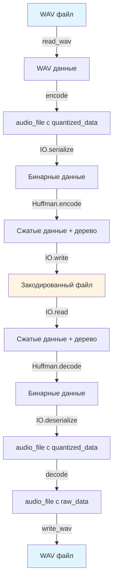

# План реализации Encoding, Decoding и IO библиотеки с Хаффманом

## Архитектура



## 1. Расширение модуля Compression (`lib/codec/utilities/compression.ml`)

### Текущее состояние:

- Есть базовое кодирование Хаффмана для `char list`
- Есть функции `bools_to_bytes` и `bytes_to_bools`

### Необходимые дополнения:

- **`encode_bytes : int list -> int list * huffman_tree option`**
  - Кодирование списка байтов (int 0-255) вместо char
  - Возвращает сжатые байты и дерево Хаффмана

- **`decode_bytes : int list -> huffman_tree option -> int list`**
  - Декодирование списка байтов обратно

- **`serialize_tree : huffman_tree -> int list`**
  - Сериализация дерева Хаффмана в бинарный формат для сохранения в файл
  - Формат: рекурсивная структура (тип узла, данные, дети)

- **`deserialize_tree : int list -> huffman_tree * int list`**
  - Десериализация дерева из бинарного формата
  - Возвращает дерево и оставшиеся байты

## 2. IO библиотека (`lib/io/reader.ml`, `lib/io/writer.ml`)

### Низкоуровневые операции:

- **Reader**: чтение int32, int16, uint8, float, string, списков из бинарного потока
- **Writer**: запись int32, int16, uint8, float, string, списков в бинарный поток
- Little-endian формат (как в WAV)

### Высокоуровневая сериализация с Хаффманом:

- **`serialize_with_huffman : audio_file -> int list`**
  - Сериализует audio_file в бинарный формат
  - Применяет кодирование Хаффмана к результату
  - Возвращает: [magic, version, tree_size, tree_data, compressed_data_size, compressed_data]

- **`deserialize_with_huffman : int list -> audio_file`**
  - Читает дерево Хаффмана из данных
  - Декодирует сжатые данные
  - Десериализует в audio_file

### Формат файла с Хаффманом:

```
[Magic: 4 bytes "ACOD"]
[Version: int32]
[HasHuffman: uint8 (0/1)]
If HasHuffman:
  [TreeSize: int32] - размер сериализованного дерева в байтах
  [TreeData: TreeSize bytes] - сериализованное дерево Хаффмана
  [CompressedSize: int32] - размер сжатых данных в байтах
  [CompressedData: CompressedSize bytes] - сжатые данные
Else:
  [UncompressedSize: int32]
  [UncompressedData: UncompressedSize bytes] - несжатые данные
```

### Формат несжатых данных (внутри):

```
[NumTracks: int32]
[BitsPerSample: int32]
[SampleRate: int32]
For each track:
  [NumSegments: int32]
  [LengthSamples: int32]
  [SampleRate: int32]
  [HasCompression: uint8 (0/1)]
  [If HasCompression: OriginalMin: float, OriginalMax: float]
  For each segment:
    [WindowType: uint8]
    [NumBands: int32]
    [FrequencyBands: list of (float, float)]
    [BandRanges: list of (float, float)]
    [QuantizationLevels: list of int32]
    [HasQuantizedData: uint8 (0/1)]
    [If HasQuantizedData: QuantizedData per band]
```

## 3. Encoder и Decoder (после тестирования всех модулей)

### Будет реализовано после завершения всех тестов базовых модулей

Encoder (`lib/codec/encoder.ml`) - будет реализован позже:

- `encode_from_wav : ?use_huffman:bool -> wav_data -> string -> unit`
- `encode_from_samples : ?use_huffman:bool -> float list -> int -> int -> string -> unit`

Decoder (`lib/codec/decoder.ml`) - будет реализован позже:

- `decode_to_wav : string -> wav_data`
- `decode_to_samples : string -> float list`

## Файлы для изменения/создания:

### Compression расширение (по одной функции + тесты)

1. **[lib/codec/utilities/compression.ml](lib/codec/utilities/compression.ml)** - добавить encode_bytes → unit тесты
2. **[lib/codec/utilities/compression.ml](lib/codec/utilities/compression.ml)** - добавить decode_bytes → unit тесты
3. **[lib/codec/utilities/compression.ml](lib/codec/utilities/compression.ml)** - добавить serialize_tree → unit тесты
4. **[lib/codec/utilities/compression.ml](lib/codec/utilities/compression.ml)** - добавить deserialize_tree → unit тесты
5. **[test/codec/utilities/test_compression.ml](test/codec/utilities/test_compression.ml)** - добавить все unit тесты + интеграционные
6. **[lib/codec/utilities/compression.mli](lib/codec/utilities/compression.mli)** - обновить интерфейс

### IO низкоуровневые функции (по одной паре + тесты)

7. **[lib/io/writer.ml](lib/io/writer.ml)** + **[lib/io/reader.ml](lib/io/reader.ml)** - write_int32/read_int32 → unit тесты
8. **[lib/io/writer.ml](lib/io/writer.ml)** + **[lib/io/reader.ml](lib/io/reader.ml)** - write_int16/read_int16 → unit тесты
9. **[lib/io/writer.ml](lib/io/writer.ml)** + **[lib/io/reader.ml](lib/io/reader.ml)** - write_uint8/read_uint8 → unit тесты
10. **[lib/io/writer.ml](lib/io/writer.ml)** + **[lib/io/reader.ml](lib/io/reader.ml)** - write_float/read_float → unit тесты
11. **[lib/io/writer.ml](lib/io/writer.ml)** + **[lib/io/reader.ml](lib/io/reader.ml)** - write_string/read_string → unit тесты
12. **[lib/io/writer.ml](lib/io/writer.ml)** + **[lib/io/reader.ml](lib/io/reader.ml)** - write_list/read_list → unit тесты
13. **[test/io/test_reader_writer.ml](test/io/test_reader_writer.ml)** - все unit тесты + интеграционные
14. **[lib/io/reader.mli](lib/io/reader.mli)** + **[lib/io/writer.mli](lib/io/writer.mli)** - интерфейсы

### IO сериализация audio_file (по одной части + тесты)

15. **[lib/io/writer.ml](lib/io/writer.ml)** + **[lib/io/reader.ml](lib/io/reader.ml)** - window_type → unit тесты
16. **[lib/io/writer.ml](lib/io/writer.ml)** + **[lib/io/reader.ml](lib/io/reader.ml)** - segment → unit тесты
17. **[lib/io/writer.ml](lib/io/writer.ml)** + **[lib/io/reader.ml](lib/io/reader.ml)** - track → unit тесты
18. **[lib/io/writer.ml](lib/io/writer.ml)** + **[lib/io/reader.ml](lib/io/reader.ml)** - audio_file → unit тесты
19. **[test/io/test_serialize.ml](test/io/test_serialize.ml)** - все unit тесты для сериализации

### IO интеграция Хаффмана

20. **[lib/io/writer.ml](lib/io/writer.ml)** - serialize_with_huffman → unit тесты
21. **[lib/io/reader.ml](lib/io/reader.ml)** - deserialize_with_huffman → unit тесты
22. **[test/io/test_huffman.ml](test/io/test_huffman.ml)** - unit тесты + интеграционные тесты
23. **[lib/io/reader.mli](lib/io/reader.mli)** + **[lib/io/writer.mli](lib/io/writer.mli)** - обновить интерфейсы

### Encoder/Decoder (после всех тестов)

24. **[lib/codec/encoder.ml](lib/codec/encoder.ml)** - реализация encoder
25. **[lib/codec/encoder.mli](lib/codec/encoder.mli)** - интерфейс encoder
26. **[lib/codec/decoder.ml](lib/codec/decoder.ml)** - реализация decoder
27. **[lib/codec/decoder.mli](lib/codec/decoder.mli)** - интерфейс decoder

## Зависимости:

- Compression расширение: использует существующий код, добавляет работу с байтами
- IO библиотека зависит от: `codec` (для типа audio_file), `codec.utilities` (для Хаффмана)
- Encoder зависит от: `wav`, `codec.utilities`, `codec`, `io`
- Decoder зависит от: `codec.utilities`, `codec`, `io`

## Стратегия тестирования (TDD подход):

### Принцип: Код -> Unit тесты -> Следующий код -> Unit тесты

1. **Реализовать одну маленькую функцию/пару функций**
2. **Сразу написать unit тесты для этой функции**:

   - Базовые случаи (happy path)
   - Edge cases (пустые списки, граничные значения, None)
   - Roundtrip тесты (если применимо)

3. **Запустить тесты, убедиться что проходят**
4. **Перейти к следующей функции**

### После группы функций:

5. **Написать интеграционные тесты** для проверки взаимодействия нескольких функций вместе
6. **E2E тесты** для проверки полного цикла (если применимо)

### Структура тестов:

- Использовать Alcotest (как в существующих тестах)
- Группировать тесты по функциональности
- Использовать `test_case` с `Quick` для быстрых тестов
- Добавить `verbose` тесты для отладки при необходимости
- Каждый тест должен быть независимым и проверять одну вещь

## Важные детали:

1. **Кодирование Хаффмана**: Применяется ко всему сериализованному файлу после сериализации
2. **Сериализация дерева**: Дерево Хаффмана должно быть сериализовано компактно для сохранения в файл
3. **Обратная совместимость**: Формат должен поддерживать файлы без Хаффмана (HasHuffman = 0)
4. **Тестирование перед интеграцией**: Каждый модуль тестируется отдельно перед использованием в следующем
5. **Обработка ошибок**: Добавить исключения для невалидных данных, тестировать их
6. **Формат данных**: Little-endian для совместимости с WAV форматом